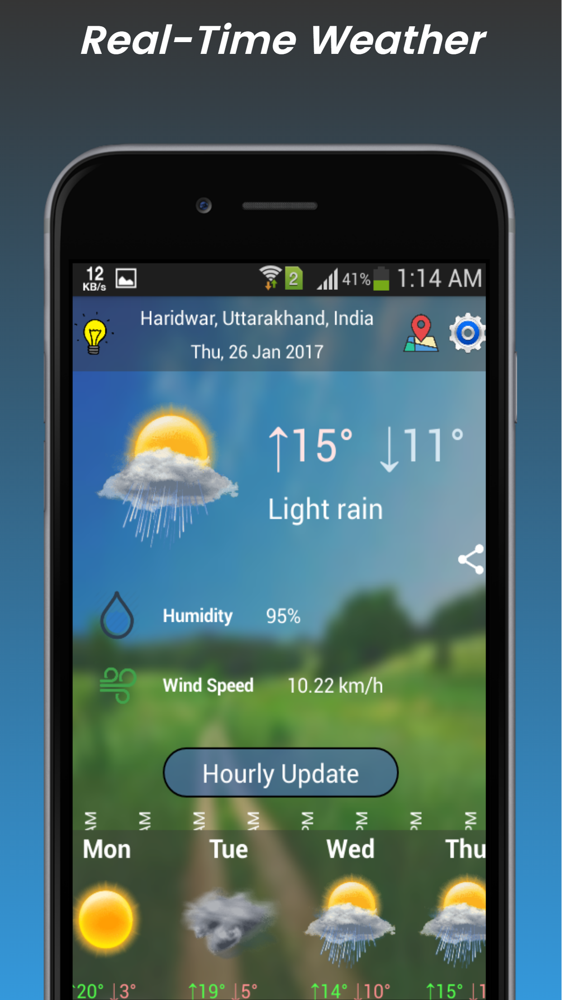
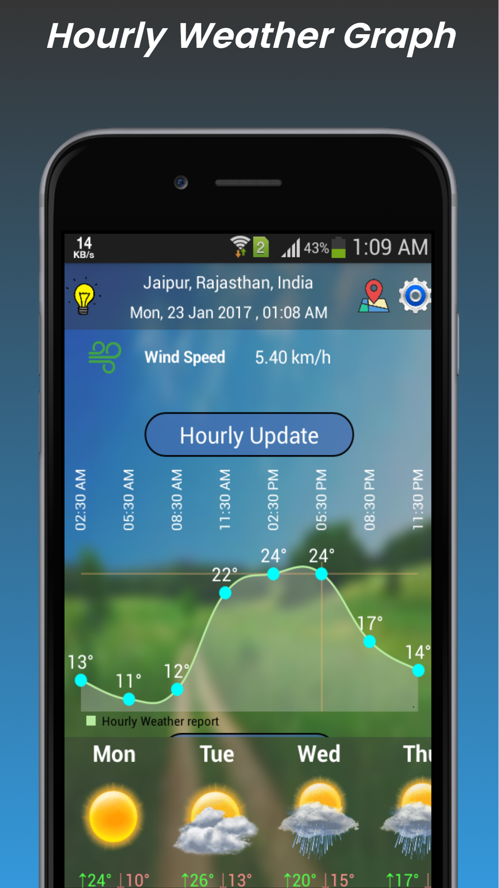
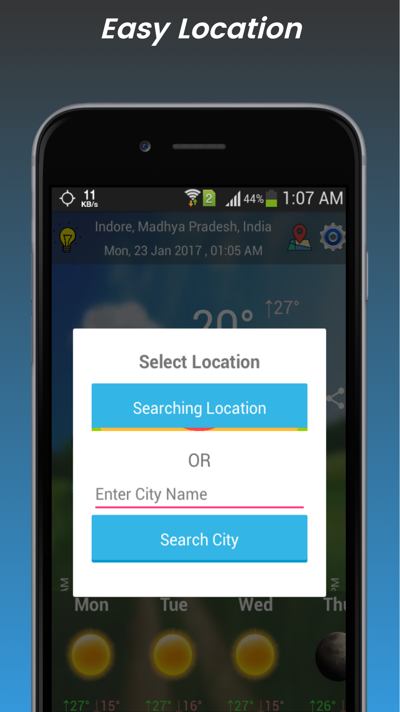
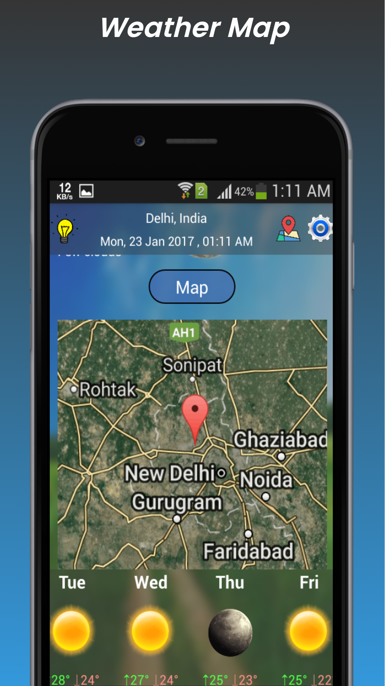
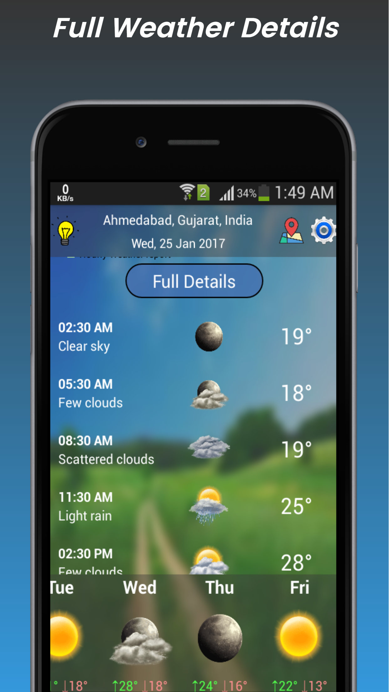

True Weather
======
**True Weather** app has the Simplest and user friendly interface with negligible data consumption, fastest and accurate weather reporting . Keep track live weather, any time, any where.

#### Screenshot

</img> 
</img> 
</img>
</img>
</img>
</img>

#### App Stores
<!-- edit this image location -->

#### Works on
* Android 4.0.3 (Ice Cream Sandwich) and above.

### Permissions
* ACCESS_COARSE_LOCATION
* ACCESS_FINE_LOCATION
* ACCESS_NETWORK_STATE
* RECEIVE_BOOT_COMPLETED
* WRITE_EXTERNAL_STORAGE
* READ_EXTERNAL_STORAGE

### Built With

* [Android Studio](https://developer.android.com/studio/index.html) - The Official IDE for Android

### Third party libraries
* Glide (https://github.com/bumptech/glide)
* okhttp (https://github.com/square/okhttp)
* android-process-button (https://github.com/dmytrodanylyk/android-process-button)
* RealtimeBlurView (https://github.com/mmin18/RealtimeBlurView)
* MPAndroidChart (https://github.com/PhilJay/MPAndroidChart)
* gson (https://github.com/google/gson)

### Authors

* **Shivam Agrawal** - [Rising Hope](http://risinghopeapps.weebly.com/)

### Version 
* Version 1.0.1

## License 
* see [LICENSE](/LICENSE) file
